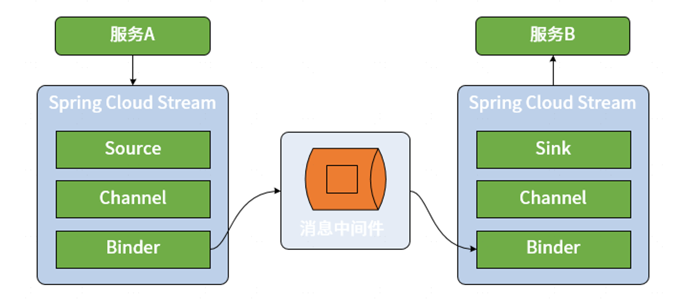

# 一、Spring Cloud Stream 基本架构

Spring Cloud Stream 对整个消息发布和消费过程做了高度抽象，并提供了一系列核心组件。我们先介绍通过 Spring Cloud Stream 构建消息传递机制的基本工作流程。区别于直接使用 RabbitMQ、Kafka 等消息中间件，Spring Cloud Stream 在消息生产者和消费者之间添加了一种桥梁机制，所有的消息都将通过 Spring Cloud Stream 进行发送和接收，如下图所示：

通过上图可以看出Spring Cloud Stream 具备四个核心组件。分别是 Binder、Channel、Source和Sink, 其中Binder和Channel是成对出现的，而Source和Sink分别面向消息的发布者和消费者。

## Source 和 Sink
在 Spring Cloud Stream 中，Source 组件是真正生成消息的组件，相当于是一个输出（Output）组件。而 Sink 则是真正消费消息的组件，相当于是一个输入（Input）组件。根据我们对事件驱动架构的了解，对于同一个 Source 组件而言，不同的微服务可能会实现不同的 Sink 组件，分别根据自身需求进行业务上的处理。

## Channel
Channel 的概念比较容易理解，就是常见的通道，是对队列的一种抽象。根在消息传递系统中，队列的作用就是实现存储转发的媒介，消息生产者所生成的消息都将保存在队列中并由消息消费者进行消费。通道的名称对应的往往就是队列的名称。

## Binder
Spring Cloud Stream 中最重要的概念就是 Binder。所谓 Binder，顾名思义就是一种黏合剂，将业务服务与消息传递系统黏合在一起。通过 Binder，我们可以很方便地连接消息中间件，可以动态的改变消息的目标地址、发送方式而不需要了解其背后的各种消息中间件在实现上的差异。